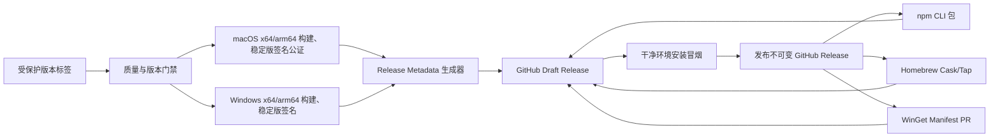

# AITracker 多渠道安装与发布架构设计文档

| 属性     | 值                                     |
| -------- | -------------------------------------- |
| 文档类型 | 架构设计文档 (ARCH)                    |
| 项目名称 | AITracker                              |
| 版本     | v1.0                                   |
| 创建日期 | 2026-09-03 14:36:53                    |
| 更新日期 | 2026-09-03 16:20:00                    |
| 生成工具 | agile-feature-dev、architecture-design |
| 文档状态 | 草稿                                   |

## 修订记录

| 版本 | 修改时间            | 修改内容                                                           |
| ---- | ------------------- | ------------------------------------------------------------------ |
| v1.1 | 2026-09-03 15:05:26 | 调整为先交付未签名 npx 和自有 Homebrew Tap，签名及官方 Cask 后置   |
| v1.2 | 2026-09-03 16:20:00 | 按当前实现校正 beta 默认频道、自有 Tap token、发布状态和验收边界   |
| v1.0 | 2026-09-03 14:36:53 | 初始版本：定义 npx、Homebrew Cask、WinGet 的统一发布架构与演进路径 |

---

## 1. 背景与目标

AITracker 当前通过 Electron Builder 生成 macOS DMG 和 Windows NSIS 安装包，发布检查、签名、公证、校验和上传主要遵循人工清单。项目希望新增三种安装入口：

- `npx @estelwalks/aitracker`：为已安装 Node.js/npm 的用户提供一条命令启动安装。
- `brew install --cask aitracker`：为 macOS 用户提供标准包管理体验。
- `winget install --id zhaoyaoyuan.AITracker -e`：为 Windows 用户提供标准包管理体验。

本设计的核心目标是：三种渠道复用同一批经过校验和冒烟验证的桌面制品，以 GitHub Releases 为唯一权威制品源，避免出现渠道间二进制、版本和安全策略漂移。正式稳定版必须经过签名；第一阶段的 beta 允许使用未签名制品，并向用户明确 Gatekeeper/SmartScreen 风险。

**当前实施基线（Phase 1）：** 当前只交付未签名 beta 的 npx CLI 和自有 Homebrew Tap 的生成与安装入口。代码已包含 release metadata、SHA-256/大小校验、平台选择、beta 安全提示、Cask 生成器、版本/tag 门禁以及 GitHub Actions 的 beta draft Release 流程；尚未完成真实 npm 发布、自有 Tap 远程仓库同步、稳定版签名、官方 Homebrew Cask、WinGet 或跨平台安装冒烟。下文标注为“后置/未实现”的能力不得视为当前可用功能。

### 1.1 成功标准

- 同一应用版本在三个渠道解析到字节一致的安装制品。
- 后续稳定版本目标是 npm 渠道在 15 分钟内可用、自有 Homebrew Tap 在 30 分钟内可用；WinGet 和官方 Homebrew Cask 受外部审核时延约束。Phase 1 不承诺这些时限，也不自动发布 npm 或同步远程 Tap。
- 校验和不匹配、目标平台不支持时，安装必须失败关闭，不能继续执行安装器；正式签名版本的签名失败同样必须阻断发布。
- 发布流程在任一制品、必需签名或核心测试失败时不得将 GitHub Release 标记为正式发布；未签名 beta 只能标记为实验频道。
- 支持 macOS `arm64`、macOS `x64`、Windows `x64`；Linux 和 Windows ARM64 不在首期范围。

## 2. 输入验证、假设与约束

### 2.1 输入完整性

| 检查项         | 状态 | 说明                                                          |
| -------------- | ---- | ------------------------------------------------------------- |
| 功能描述       | ✅   | 三个目标安装渠道和现有 Electron 客户端均已明确                |
| 技术选型约束   | ✅   | npm、Homebrew Cask、WinGet、GitHub Releases、Electron Builder |
| 团队与所有权   | ⚠️   | 从单仓库、单一 CI 和人工发布清单推断为小团队维护              |
| 现有系统上下文 | ✅   | 已有 DMG/NSIS 构建、GitHub Release 更新器和发布清单           |

### 2.2 假设

| 假设                                         | 置信度 | 影响                                                           |
| -------------------------------------------- | ------ | -------------------------------------------------------------- |
| 使用公开 GitHub 仓库和 GitHub-hosted Actions | 高     | 可使用公开 Release、npm OIDC trusted publishing 和 provenance  |
| 维护团队为 1–3 人                            | 中     | 选择单仓库、少量工作流和模板生成，不引入独立发布服务           |
| 首期发布量为每月 1–4 次                      | 中     | GitHub Releases 和社区包仓库足以承载，无需自建 CDN             |
| 用户接受 npx 拉起原生安装器并完成系统确认    | 中     | npx 不承诺跨平台完全静默安装；未签名 beta 可能出现系统安全提示 |
| 正式 Cask 和 WinGet 只跟踪稳定频道           | 高     | 降低外部仓库频繁审核和预发布版本排序风险                       |

### 2.3 约束

- 现有根包保持私有，不直接把完整 Electron 工程发布到 npm。
- 正式稳定 macOS 制品必须完成代码签名和 notarization；正式稳定 Windows 制品应完成 Authenticode 签名。第一阶段实验 beta 可以不签名，但必须在安装说明中标注风险。
- Release URL 必须不可变；发布后不得覆盖同名安装包。
- 包管理器清单不得指向 `latest/download` 等可变 URL，必须包含版本化 URL 和 SHA-256。
- npx 包不得利用 `postinstall` 隐式下载或运行安装器，只能在用户显式执行命令后开始操作。

## 3. 架构驱动因素

### 3.1 功能驱动

- 识别操作系统、CPU 架构和发布频道。
- 为每个渠道生成符合其协议的元数据。
- 对安装包进行签名、校验、发布和回滚。
- 支持稳定版、beta 版和精确版本安装。
- 保持应用内更新与外部安装渠道的版本规则一致。

### 3.2 非功能驱动

| 属性     | 目标                                                                               |
| -------- | ---------------------------------------------------------------------------------- |
| 安全     | 下载后、执行前校验 SHA-256；稳定版安装包必须签名；npm 使用 OIDC trusted publishing |
| 一致性   | `package.json` 版本、Git tag、Release、npm 包、Cask、WinGet 清单必须一致           |
| 可恢复性 | 渠道发布失败不破坏已发布版本；支持撤回清单、弃用 npm 版本和标记问题 Release        |
| 可维护性 | 渠道元数据由同一个 release metadata 自动生成，禁止人工重复录入 hash/URL            |
| 可观测性 | 每次发布产生渠道状态矩阵、制品 hash、签名检查和外部 PR 链接                        |
| 供应链   | 最小权限、受保护发布环境、不可变制品、来源证明和第三方仓库校验                     |

## 4. 推荐系统形态

采用“单一制品源 + 发布编排工作流 + 三个薄渠道适配器”的模块化发布架构。它仍属于当前单仓库的一部分，不新增长期运行的后端服务或数据库。



该形态优先优化可维护性和供应链一致性。代价是 GitHub Releases 成为所有渠道的共同外部依赖；通过不可变 URL、缓存型包管理器和可迁移的 metadata 契约降低锁定风险。

## 5. 组件边界与职责

| 组件                        | 职责                                                                 | 建议位置                                                 |
| --------------------------- | -------------------------------------------------------------------- | -------------------------------------------------------- |
| Release Gate                | 校验版本、工作树/tag、测试、许可证、隐私和 bundle 门禁               | `.github/workflows/release.yml`、现有 `scripts/verify-*` |
| Artifact Builder            | 生成三类安装包；按发布级别执行签名、公证                             | 现有 Electron Builder 配置及平台 runner                  |
| Release Metadata Generator  | 汇总版本、频道、URL、文件大小和 SHA-256；生成渠道输入                | `scripts/release/`                                       |
| Canonical Release Publisher | 创建 draft、上传制品、完成冒烟后发布 GitHub Release                  | GitHub Actions                                           |
| npx Adapter                 | 发布小型 Node CLI，识别平台并校验、打开原生安装器                    | `packages/cli/`                                          |
| Homebrew Adapter            | 从 metadata 生成 arm/intel Cask 并更新自有 Tap/提交官方仓库          | `packaging/homebrew/` 或独立 Tap 仓库                    |
| WinGet Adapter              | 从 metadata 生成 installer/defaultLocale/version manifests 并提交 PR | `packaging/winget/`                                      |
| Desktop Update Consumer     | 按相同频道和校验规则发现、下载并打开更新                             | `electron/update-manager.ts`                             |
| Release Status Reporter     | 汇总 npm、Tap、Homebrew PR、WinGet PR 的状态和链接                   | workflow summary / release issue                         |

边界规则：渠道适配器只能读取 release metadata，不得自行重新构建应用；制品构建器不得直接发布渠道元数据；只有 Release Gate 通过后才允许发布对应频道。未签名 beta 必须经过实验频道专用 gate，不得进入稳定频道或官方 Homebrew Cask。

## 6. 数据与契约设计

### 6.1 Release Metadata

每个版本生成一个不可变的 `release-metadata.json`，与安装包一起附加到 GitHub Release。建议契约：

```json
{
  "schemaVersion": 1,
  "appVersion": "1.0.0",
  "channel": "stable",
  "gitTag": "v1.0.0",
  "gitCommit": "<40-char-sha>",
  "publishedAt": "<ISO-8601>",
  "artifacts": {
    "darwin-arm64": {
      "name": "AITracker-arm64.dmg",
      "url": "https://github.com/zhaoyaoyuan/aitracker/releases/download/v1.0.0/AITracker-arm64.dmg",
      "sha256": "<hex>",
      "size": 0
    },
    "darwin-x64": {
      "name": "AITracker-x64.dmg",
      "url": "<immutable-url>",
      "sha256": "<hex>",
      "size": 0
    },
    "win32-arm64": {
      "name": "AITracker-Setup-arm64.exe",
      "url": "<immutable-url>",
      "sha256": "<hex>",
      "size": 0,
      "installerType": "nullsoft",
      "scope": "machine"
    },
    "win32-x64": {
      "name": "AITracker-Setup-x64.exe",
      "url": "<immutable-url>",
      "sha256": "<hex>",
      "size": 0,
      "installerType": "nullsoft",
      "scope": "machine"
    }
  }
}
```

安装包文件名不带版本号（`AITracker-arm64.dmg`、`AITracker-Setup-x64.exe` 等），版本只记录在 `appVersion`/`gitTag` 中，这样 `releases/latest/download/<文件名>` 才能跨版本稳定指向最新发布，README 与 `npx` 入口无需每次发版修改。生成器必须校验：制品 URL 属于本仓库的 Release 下载地址、每个必需平台恰好一个制品、hash 为 64 位小写十六进制、文件大小大于零；`scripts/verify-release-artifact-names.mjs` 另外守住打包配置，禁止版本号重新进入文件名模板。

### 6.2 版本与频道契约

- `package.json` 的应用版本是版本输入源；Git tag 必须严格为 `v${version}`。
- 稳定版本：GitHub Release `prerelease=false`，npm dist-tag=`latest`，更新正式 Cask 和 WinGet。
- beta 版本：GitHub Release `prerelease=true`，npm dist-tag=`beta`，更新自有 Tap 的 beta Cask；第一阶段 beta 可使用未签名制品，默认不提交 WinGet 或官方 Homebrew Cask。
- npm CLI 版本与应用版本相同。`npx @estelwalks/aitracker@1.2.3` 必须只安装 AITracker 1.2.3；不得在运行时静默切换到其他版本。
- 应用内更新必须区分 stable/beta。稳定版不能因为 GitHub 上出现更新的 beta 而自动升级到 beta。

### 6.3 发布状态模型

`prepared → built → integrity-verified → [signed for stable] → draft-uploaded → smoke-verified → released → channels-publishing → complete`

任一状态失败均停止向后推进。GitHub Release 发布后，渠道失败不回滚已发布桌面版本，而是记录为“渠道滞后”并重试对应适配器。

## 7. 渠道集成设计

### 7.1 npx

根 Electron 包继续保留 `private: true`；新增独立公开包 `@estelwalks/aitracker`，并保留 `aitracker` 作为 bin 命令名。npx 第一阶段允许下载未签名 beta 安装包，但必须在命令输出和 README 中说明用户可能需要手动放行系统安全提示。

CLI 的 `bin` 命令执行以下步骤：

1. 读取随 npm 包发布的同版本 release metadata。
2. 识别 `process.platform` 和 `process.arch`，仅接受白名单组合。
3. 下载到系统安全临时目录，限制最大文件大小，禁止跟随到非 GitHub Release host 的重定向。
4. 流式计算 SHA-256 并与 metadata 比较。
5. macOS 使用系统 `open` 打开 DMG；Windows 以无 shell 参数数组启动 NSIS 安装器并等待启动结果。
6. checksum 不符、下载中断或平台不支持时删除临时文件并返回非零退出码。

命令契约：

- `npx --yes @estelwalks/aitracker`：按当前 CLI 包版本推导频道；当前 `@estelwalks/aitracker@1.0.0-beta.1` 默认解析 beta。
- `npx --yes @estelwalks/aitracker --channel beta`：安装当前 beta；稳定版发布后再使用 `--channel stable`。
- `npx --yes @estelwalks/aitracker@1.2.3`：安装精确版本。
- `aitracker --dry-run`：只显示将使用的版本、平台、URL 和 hash，不下载。
- `aitracker --download-only <dir>`：下载并校验但不打开安装器，便于 CI/企业分发。

CLI 使用独立 `engines`，建议以 Node.js 20 为最低基线，不能继承桌面开发环境的 Node.js 24 要求。官方 npm 文档说明 `npx` 基于 `npm exec`，会从包的 `bin` 字段选择命令并使用 npm 缓存：[npm exec 文档](https://docs.npmjs.com/cli/v11/commands/npm-exec/)。

发布认证使用 npm trusted publishing/OIDC；公开仓库和公开包可自动生成 provenance：[npm trusted publishing](https://docs.npmjs.com/trusted-publishers/)。

### 7.2 Homebrew Cask

分两阶段：

- 首发阶段维护 `zhaoyaoyuan/homebrew-aitracker` 自有 Tap，Phase 1 beta 命令为 `brew install --cask zhaoyaoyuan/aitracker/aitracker-beta`。该阶段允许使用未签名 DMG，用户可能需要手动通过 macOS Gatekeeper 放行；当前仓库只提供模板和生成器，远程 Tap 尚未发布。
- 获得 Apple Developer/Developer ID 并完成 notarization 后，再提交 `Homebrew/homebrew-cask`，最终支持 `brew install --cask aitracker`。官方收录完成前，README 不应宣称无 Tap 的命令可用。

Cask 使用当前两份版本化 DMG，并通过 `arch` 为 Apple Silicon/Intel 分别配置 URL 与 SHA-256；artifact 为 `app "AITracker.app"`。自有 Tap 的第一阶段只要求生成的 Cask 语法/style、URL 和 hash 正确；官方 Cask 还必须通过 Gatekeeper 检查，不能要求用户绕过 Gatekeeper：[Cask Cookbook](https://docs.brew.sh/Cask-Cookbook)、[Acceptable-Casks](https://docs.brew.sh/Acceptable-Casks)。当前 beta token 为 `aitracker-beta`；稳定 token `aitracker` 仅作为后续稳定频道模板，不代表当前已有可安装的稳定 Release。

更新流程从 release metadata 生成 Cask，依次执行 style/audit/install/uninstall/zap 测试，再提交 Tap commit 或上游 PR。禁止手工复制 hash。

### 7.3 WinGet

使用现有 Windows x64/arm64 NSIS 安装器，首期 PackageIdentifier 建议为 `zhaoyaoyuan.AITracker`，最终 Publisher 字段必须与 Windows“应用和功能”中安装器写入的 Publisher 完全一致。

生成三文件 manifest：version、installer、defaultLocale。关键字段包括：

- `Architecture: x64`、`Architecture: arm64`
- `InstallerType: nullsoft`
- `Scope: machine`（与当前 Electron Builder `perMachine: true` 一致）
- 版本化 `InstallerUrl` 和 `InstallerSha256`
- `AppsAndFeaturesEntries` 中与卸载注册表一致的 DisplayName、Publisher、DisplayVersion；可获得时加入 ProductCode
- 静默安装/卸载和升级行为

首次使用 `wingetcreate new` 生成并人工审查，执行 `winget validate` 和 Windows Sandbox 安装测试后，向 `microsoft/winget-pkgs` 提交 PR；后续由 release workflow 生成更新 PR。Microsoft 官方要求清单描述公开安装器并经社区仓库自动/人工验证：[创建清单](https://learn.microsoft.com/en-us/windows/package-manager/package/manifest)、[提交清单](https://learn.microsoft.com/en-us/windows/package-manager/package/repository)。

## 8. 应用内更新一致性

现有更新器已经从 GitHub Releases 选择平台制品，当前实现已补齐两个边界：

- 根据当前安装频道过滤 `prerelease`，稳定用户不得自动看到 beta。
- 下载后读取 release metadata，流式校验 SHA-256、大小和可信 URL，通过后才能打开安装器。

首期不生成渠道专用 Electron 二进制，也不试图自动识别“由 Homebrew/WinGet 安装”。所有渠道仍可使用应用内更新；Homebrew/WinGet manifest 必须在稳定 Release 发布后尽快跟进。代价是短暂出现“应用已自更新、包管理器清单尚滞后”的状态。若企业用户需要完全由包管理器管控，再在后续版本增加 `managedUpdates` 策略或渠道标记。

## 9. 运行时、部署与发布顺序

### 9.1 工作流划分

- `ci.yml`：维持日常类型、lint、测试、bundle 和隐私门禁。
- `release.yml`：当前已实现受 tag 触发的未签名 beta 平台矩阵构建、版本/tag 门禁、metadata/checksum 生成和 draft prerelease 创建；不自动发布 npm、同步 Tap 或提交外部 PR。
- `release-publish.yml`、`release-reconcile.yml`：后置设计，当前未实现。

### 9.2 推荐顺序

1. 在干净 tag 上运行全部 release gates。
2. 平台矩阵构建安装包；稳定频道执行签名和公证，实验 beta 可跳过签名。
3. 生成 release metadata、checksums 和 SBOM/许可证证据。
4. 上传到 draft GitHub Release。
5. 在干净 macOS/Windows 环境执行安装、启动、升级和卸载冒烟；稳定频道额外验证签名，未签名 beta 验证安全提示和文档指引。
6. 将 draft 标记为 published。
7. （后置）发布同版本 npm CLI，并设置 `latest` 或 `beta` dist-tag。
8. （后置）更新自有 Homebrew Tap 远程仓库；Phase 1 当前只生成本地 Cask。
9. （后置）为稳定版提交官方 Homebrew Cask/WinGet PR。
10. 输出渠道状态矩阵并在失败时创建可重试记录。

## 10. 安全与可观测性

### 10.1 安全控制

- Git tag 和 release environment 启用保护与人工审批。
- npm 使用 OIDC trusted publisher，不保存长期发布 token。
- 稳定版 macOS/Windows 签名密钥只存在于受保护的 CI secret/environment；实验 beta 不配置签名密钥，日志不得输出任何证书或口令。
- CLI 下载采用 `fetch`/HTTPS、host 白名单、大小上限、超时和 SHA-256；启动子进程必须 `shell: false`。
- Release metadata、Cask、WinGet manifest 中的 URL 必须经过仓库和 tag 校验。
- GitHub Release 发布后启用不可变策略或流程约束，不覆盖资产。

### 10.2 可观测性

每次发布输出：commit、版本、频道、三类制品 hash、签名验证结果、冒烟测试结果、npm 页面、Tap commit、Homebrew PR、WinGet PR。渠道状态采用 `pending/succeeded/failed/lagging`，失败时保留日志和重试入口，但不采集终端用户隐私遥测。

## 11. 故障、回滚与恢复

| 故障                         | 行为                                                  | 恢复                                                      |
| ---------------------------- | ----------------------------------------------------- | --------------------------------------------------------- |
| 任一平台构建或稳定版签名失败 | 保持 draft，不发布正式渠道                            | 修复后从干净 tag 重新构建；实验 beta 可单独发布未签名制品 |
| 安装冒烟失败                 | 保持 draft                                            | 上传新版本号制品，不覆盖原资产                            |
| npm 发布失败                 | GitHub Release 保持有效，标记 npm failed              | 重跑 npm adapter；不得重发不同内容的同版本包              |
| Cask/WinGet PR 被拒          | 记录原因，其他渠道不回滚                              | 修正生成器/清单后重提                                     |
| checksum 不一致              | CLI/包管理器阻止安装                                  | 撤回问题 Release，发布补丁版本                            |
| 已发布版本有严重缺陷         | 停止渠道推广、npm deprecate、撤回/回滚清单            | 发布修复版本；不依赖 npm unpublish                        |
| GitHub API 限流              | 精确版本 CLI 使用包内 metadata，不依赖运行时查 latest | 稳定/测试命令使用 npm dist-tag 解析版本                   |

## 12. 关键权衡

| 决策                         | 收益                             | 代价/风险                                   | 复审触发条件                         |
| ---------------------------- | -------------------------------- | ------------------------------------------- | ------------------------------------ |
| GitHub Releases 为唯一制品源 | 三渠道字节一致、现有更新器可复用 | GitHub 成为共同依赖                         | 下载量、区域可用性或带宽成本显著上升 |
| npm 只发布薄 CLI             | 包小、发布快、不复制 Electron    | npx 用户仍需系统安装确认且必须已有 Node/npm | 大量非开发者把 npx 作为主入口        |
| CLI 版本与应用版本相同       | 精确版本语义清晰、回滚简单       | 每个应用版本都要发布 npm 包                 | CLI 与应用发布节奏明显分离           |
| 官方包仓库只推稳定版         | 降低审核噪声和升级排序风险       | beta 覆盖面较小                             | beta 用户成为主要用户群              |
| 首期共用同一桌面制品         | 签名和测试矩阵最小               | 应用内更新与包管理器可能短暂不同步          | 企业要求禁止自更新或渠道特定策略     |
| 社区仓库通过 PR 更新         | 生态原生、用户信任高             | 外部审核不可控                              | SLA 要求无法接受审核延迟             |

## 13. 分阶段落地

- 阶段 A：统一制品合同。补齐 metadata、checksum、频道过滤和 draft release 门禁；签名作为稳定频道 gate，不阻塞实验 beta。
- 阶段 B（当前 Phase 1）：未签名 beta 入口。代码和模板已就绪，目标命令为 `npx @estelwalks/aitracker --channel beta` 和 `brew install --cask zhaoyaoyuan/aitracker/aitracker-beta`；真实 npm/Tap 发布及用户环境验证尚未完成，并必须明确 Gatekeeper/SmartScreen 提示。
- 阶段 C：稳定渠道。获得签名凭据并发布首个签名稳定版，再提交官方 Cask 和 WinGet manifest。
- 阶段 D：自动化与运营。实现渠道 PR 自动生成、失败重试、发布状态矩阵和回滚演练。

## 14. 测试设计输入

必须覆盖以下高风险流程：

- 三个平台/架构组合的 artifact 选择与不支持平台拒绝。
- 下载重定向、超时、截断、超大文件和 checksum 篡改。
- stable/beta/精确版本解析及稳定版隔离 beta。
- 未签名 beta 的 macOS Gatekeeper 提示、安装、启动、升级、卸载；稳定版额外覆盖签名、公证和 Gatekeeper。
- Windows Authenticode、NSIS 静默参数、UAC、安装、升级、卸载和 Add/Remove Programs 字段。
- Homebrew arm/intel URL、hash、install/uninstall/zap 和版本升级。
- WinGet validate、SandboxTest、install/upgrade/uninstall 和 manifest correlation。
- Release 任一阶段失败时不发生部分正式发布；渠道适配器可重入。

## 15. 风险与待确认项

| 风险/待确认                                 | 概率 | 影响 | 应对                                                            |
| ------------------------------------------- | ---- | ---- | --------------------------------------------------------------- |
| macOS/Windows 签名凭据尚未准备              | 中   | 高   | 不阻塞未签名 beta；作为稳定渠道和官方 Cask 的硬阻塞项           |
| Homebrew 官方收录受 notability/安全要求影响 | 中   | 中   | 自有 Tap 作为立即可用路径，官方命令待上游合并后公布             |
| WinGet Publisher 与安装器注册表不一致       | 中   | 高   | 在干净 Windows 主机读取真实 ARP 字段后锁定 identifier/metadata  |
| npm 非 scope 名称与现有包过于相似          | 已确认 | 中   | 采用 `@estelwalks/aitracker` 并使用 `--access public` 发布         |
| npm 包和自有 Tap 尚未完成真实远程发布       | 高   | 高   | Phase 1 先完成本地生成与 draft 验证，再执行维护者授权的外部发布 |
| GitHub community PR 审核时延                | 高   | 低   | 状态矩阵显示 lagging，不把外部合并时间纳入核心发布原子性        |

## 16. 自检摘要

### 已修正项

- 将三渠道独立发布收敛为单一制品源，消除二进制漂移。
- 明确 stable/beta 规则，避免当前“按最高版本排序”误把 beta 推给稳定用户。
- 将 checksum 校验纳入 npx 和应用内更新的执行前门禁。
- 把官方 Homebrew 收录的不确定性隔离在自有 Tap 之后，保证可增量交付。
- 将 WinGet 的 scope、installer type 和 ARP correlation 纳入验收条件。

### 遗留待确认项

- Apple Developer/Developer ID 和 Windows Authenticode 仅在进入稳定签名渠道前确认；不阻塞第一阶段未签名 beta。
- 稳定版是否允许应用内自动安装更新，还是仅通知用户通过原渠道升级。
- npm 正式包名采用作用域包 `@estelwalks/aitracker`，发布时使用 `--access public`。
- Publisher 的正式展示值及 WinGet PackageIdentifier 最终值。

### 使用的假设

- 小团队单仓库维护、GitHub-hosted Actions、每月 1–4 次发布。
- 第一阶段不支持 Linux、Windows ARM64、完全无人值守的跨平台 npx 安装、macOS 签名和官方 Homebrew Cask。
- 官方社区仓库只接收稳定版，beta 通过 npm dist-tag 和自有 Tap 提供。
